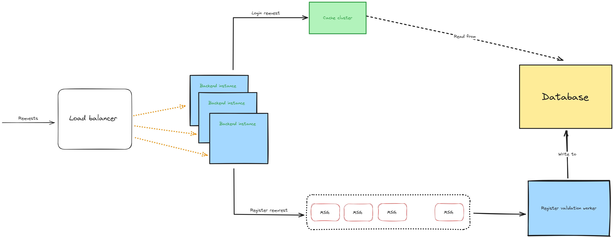

## Golang backend for login with high concurent users

#### What has been used
* [gin](https://github.com/gin-gonic/gin) - HTTP server
* [sqlx](https://github.com/jmoiron/sqlx) - Extensions to database/sql
* [pgx](https://github.com/jackc/pgx) - PostgreSQL driver and toolkit for Go
* [uuid](https://github.com/google/uuid) - UUID
* [dotenv](https://github.com/joho/godotenv) - Dot file for enviroment variables
* [jwt](https://github.com/golang-jwt/jwt/v4) - JSON Web Tokens (JWT)
* [bloom filter](https://github.com/bits-and-blooms/bloom/v3) - Statisticial map for quick existance check
* [migrate](https://github.com/golang-migrate/migrate) - Database migrations. CLI and Golang library.
* Cache - leaving blank implemention
* Message queue - leaving blank implemtaion

## Database

#### Using postgresql with following tables

Table users:
| Fields       | type         |
| ------------ | ------------ |
| userid       | UUID         |
| username     | varchar(255) |
| email        | varchar(255) |
| phone_number | varchar(255) |
| password     | varchar(255) |
| full_name    | varchar(255) |
| birth_date   | date         |
| last_login   | timestamp    |
| discount     | []uuid       |

Table coupons
| Fields          | type         |
| --------------- | ------------ |
| couponid        | uuid         |
| code            | varchar(255) |
| discount        | decimal(5,2) |
| expiration_date | date         |
| created_at      | timestamp    |

For more details please see [migration file](mirgration\00001_create_initial_tables.up.sql)

## HTTP API spec

#### Login

 
<code>POST</code> <code><b>/login</b></code> 

##### Parameters

> | name|type|data type|description|
> |-----------|-----------|-----|------|
> | username |  optional | application/x-www-form-urlencoded | N/A  |
> | email | optional | application/x-www-form-urlencoded | N/A |
> | phone_number | optional | application/x-www-form-urlencoded | N/A |
> | password | required | application/x-www-form-urlencoded | N/A |

##### Responses

> | http code|content-type| response|
> |----------|------------|-------------------|
> | `200`         | `application/json`        | `{"access_token": "", "refresh_token": ""}`|
> | `400`         | `application/json`        | `{"code":"400","message":"invalid request"}`|
> | `403`         | `application/json`        | `{"code":"403","message":"invalid password"}` |
> | `404`         | `application/json`        | `{"code":"404","message":"user not found"}` |
> | `500`         | `application/json`        | `{"code":"500","message":"internal server error"}` |

#### Register

 
<code>POST</code> <code><b>/login</b></code> 

##### Parameters

> | name|type|data type|description|
> |-----------|-----------|-----|------|
> | username |  optional | application/json | N/A  |
> | email | optional | application/json | N/A |
> | phone_number | optional | application/json | N/A |
> | password | required | application/json | N/A |
> | birthdate | optional | application/json | N/A |

##### Responses

> | http code|content-type| response|
> |----------|------------|-------------------|
> | `200`         | `application/json`        | `{"code":"200","message":"success"}`|
> | `400`         | `application/json`        | `{"code":"400","message":"invalid request"}`|
> | `500`         | `application/json`        | `{"code":"500","message":"internal server error"}`|

## Overall Architech 

### Handle high concurent users strategies

#### Scale backend server across multiple nodes
All the requests go through a load balancer, and then will be distributed into multiple backend instance.
For each certain type of request, backend handles it directly or send it to another worker to take over the job.

#### Message queue
Asynchronize tasks are sends via message queue to improve system throughput.

#### Add read replicas
Some tasks are read-heavy, somes are write-heavy. So split master database to multiple read replicas will improve SELECT statement performance.

#### Caching
Caching comes with various methods: user's device cache, CDN, in-mem cache, internal db cache.
